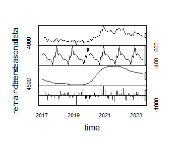

# Modulo-7
# RESERVAS BANCARIAS DEL ECUADOR
## PERÍODO: 2017-2023 (FRECUENCIA MENSUAL)
> La base datos recoge 78 observaciones de las reservas bancarias del Ecuador en millones de dólares, la data fue obtenida del Banco Central del Ecuador

<Aligne center>

